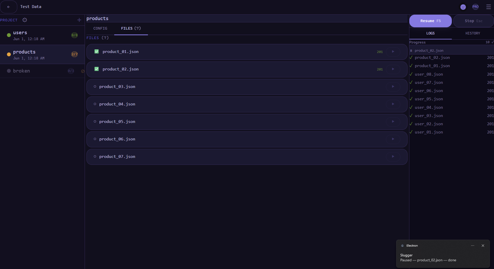
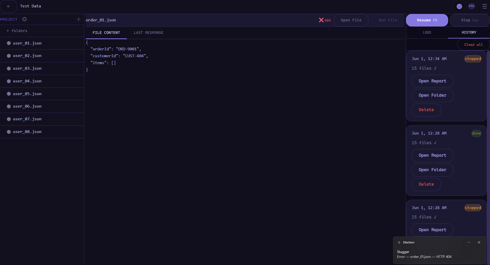
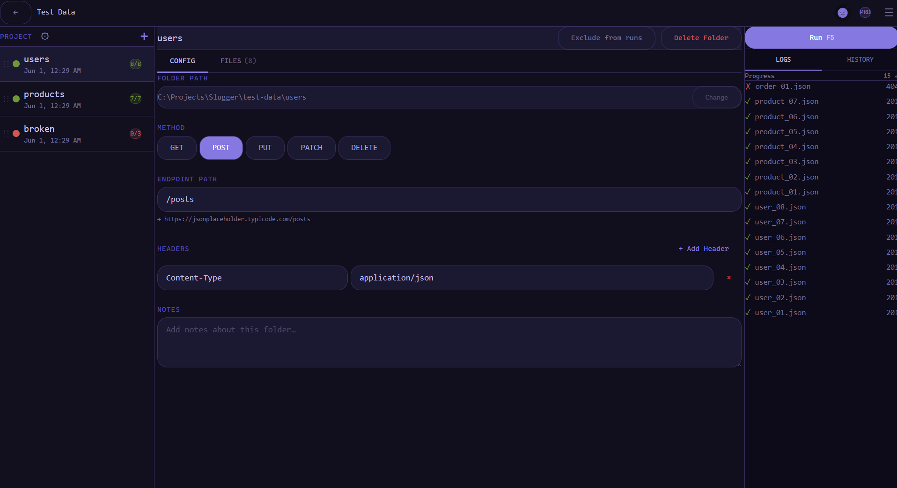
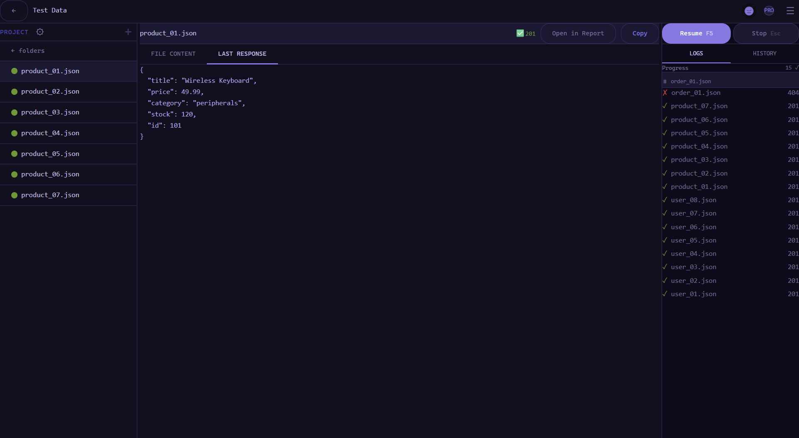

# Slugger

Stop writing throwaway scripts for batch API jobs. Seed databases, migrate data, fire webhooks — Slugger tracks every run.

    

Running HTTP jobs by hand means lost progress when auth expires mid-session, no record of which files succeeded or failed, and a restart from scratch every time something breaks. Slugger maps folders of JSON files to HTTP endpoints, runs them sequentially with automatic token refresh, and writes a timestamped Markdown report after every folder. Pause mid-run and resume from the exact file where you stopped — nothing is lost.
Redux Toolkit · Clean Architecture · JWT Ed25519 activation · 555 unit tests

---

## Download

**[Download Slugger v0.2.1 (Windows)](https://github.com/Soneka96/Slugger-Showcase/releases/tag/v0.2.1)**

1. Download and run the installer
2. Click **New Project**, add a folder of `.json` files, and set an endpoint URL
3. Click **Run**

---

## What it does

Pick a folder of `.json` files and point it at an HTTP endpoint. Slugger sends each file as a request — in order, one at a time — and marks every file green, amber, or red as results come in. Pause mid-run and resume from the exact file where you stopped — the sidebar shows which folders are done, in progress, and which haven't started:

Auth is handled automatically: configure a login endpoint and token path once, and Slugger fetches a token before the run starts, injects it into every request, and re-authenticates if a response signals expiry.

Every run is saved to history with a timestamped Markdown report per folder. When a run stops on an error, Slugger auto-opens the failing file so you know immediately what to fix:

---

## Features

- **Pause and resume** — stop mid-run; the next run continues from the exact file where it stopped; nothing re-runs unnecessarily
- **Run Missing** — re-run only files that have not yet succeeded, skipping anything already green
- **Auto token refresh** — configure a login endpoint once; Slugger fetches and injects a token, re-authenticates on expiry, and retries without interrupting the run
- **Timestamped Markdown reports** — written per folder and aggregated per run; each segment produces a `segment_N.md` with per-file response bodies
- **Run history** — every past run stored with file count, status badge, and a direct link to the report; auto-opens the failing file on error
- **Per-file detail view** — raw request content and last API response, pretty-printed; open any response line directly in VS Code or Cursor
- **Multi-folder select** — pick multiple folders at once from the system picker; drag to reorder
- **Project export / import** — share a full project config as a `.slugger.json` file; missing paths flagged on import; export requires Pro
- **Free tier batching** — free tier runs up to 5 folders or 50 files per batch; auto-stop is always resumable free; Resume after a manual pause requires Pro
- **JWT licensing** — Ed25519 asymmetric; free tier always available; pro tier upgrades without restart; individual features can be unlocked via `features[]` claim

Each folder maps to its own endpoint — method, path, and custom headers configured once. The URL preview shows the full request URL before you run anything:

Every file's last response is stored and pretty-printed — copy it, open it in your report, or compare it against the next run:

---

## Tech stack

| | |
|---|---|
| **Stack** | Electron · React 18 · TypeScript · Vite |
| **State** | Redux Toolkit · Clean Architecture |
| **Storage** | SQLite (better-sqlite3) |
| **Auth / licensing** | JWT EdDSA (Ed25519) · jose |
| **Tests** | 555 unit tests · Vitest |

---

## Design decisions

**Why pause/resume instead of retry?**
Batch jobs against real APIs are not idempotent — sending the same file twice creates duplicate records, fires webhooks twice, and triggers side effects that can't be undone. Retry-from-scratch treats partial completion as no completion, which is wrong by default for any API with state. The decision to persist per-file outcome in SQLite as each request completes means run state survives process death and auth expiry without ambiguity. The tradeoff is schema complexity over simplicity — a retry loop is easier to write, but correctness can't be sacrificed here.

**Why Ed25519 (EdDSA) over HMAC or RS256 for licensing?**
HMAC requires the secret on both sides — shipping it in the app means anyone can forge a license. RS256 works asymmetrically but the key is larger and signing is slower. Ed25519 gives asymmetric verification (public key only ships in the app), small key size, and fast verification. The private key never leaves the developer machine.

**Why SQLite over a remote store for run history?**
The app is fully offline by design. Users run it against internal APIs that may not have internet access. SQLite keeps history, reports, and project config local — no account, no sync, no data leaving the machine.

---

## Source

Interested in a demo or the source? Email sonekasenior@gmail.com
